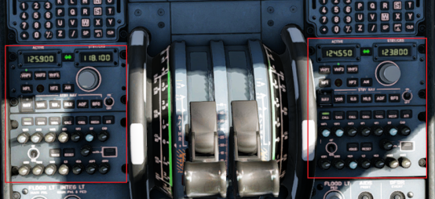
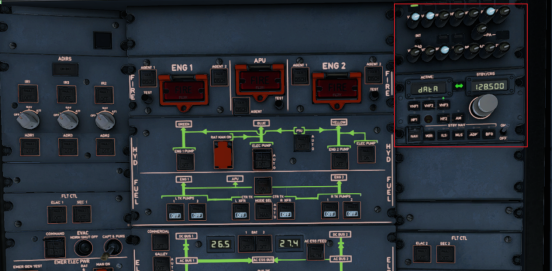
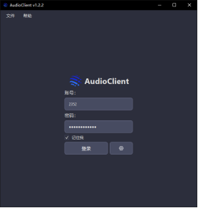
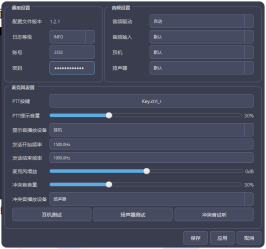
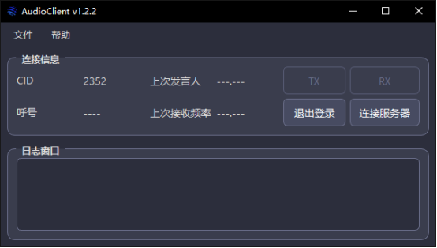
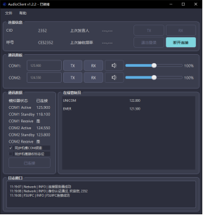
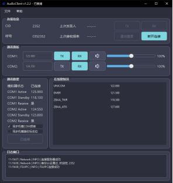
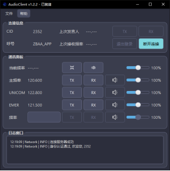
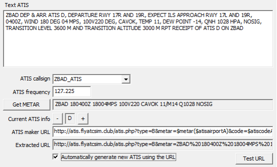

# Audio Client 使用教程

Audio Client Using Tutorial

## 修订记录

| 日期       | 修订人 | 版本号 | 修改内容 |
| ---------- | ------ | ------ | -------- |
| 2026.02.18 | 2352   | V1.0   | 初版     |

## 前言

欢迎各位加入APOC天启模拟飞行连飞平台（后文简称为APOC）！

APOC致力于打造一个专业、友好、活跃的模拟飞行社区，无论您是刚刚接触模拟飞行的新手，还是已有数千小时的飞行大佬，APOC都衷心祝愿您在这里的每一次飞行都能顺畅、专业且充满收获。

为指导飞行员与管制员更好地在本平台进行连线飞行与管制，APOC技术支持部特编写本文，旨在：

1. 为各位飞行员与管制员理解平台语音调频逻辑，以更好地使用语音调频软件。

2. 为各位飞行员与管制员详细介绍AudioClient的使用方法，阐明可能产生的问题，以及如何解决。

APOC技术支持部祝各位连飞愉快！																	APOC技术支持部

## 第一章 语音通信概述

APOC语音系统的设计核心理念是 “基于模拟飞行场景，尽可能模拟现实无线电通讯”。我们并未机械照搬真实无线电的所有复杂规则，而是在保留核心拟真要素的基础上，开发了一套更契合连飞实际使用场景的语音系统。本章将详细阐述其核心逻辑。

### 1.1 频率独占与干扰机制

在真实的航空无线电环境中，同一频率在同一时刻只能有一个信号源发射。如果有两个或以上的信号源同时讲话，就会产生严重的混叠干扰，导致所有在该频率上的收听者都无法听清任何信息。

APOC语音系统完整保留了这一特性。

这意味着：

- 飞行员与管制员必须遵守“先听后说”的原则：在发射前确认频率空闲，避免造成无意干扰

- 多人同时按键发射时，AudioClient会模拟真实的干扰效果，以此提醒使用者维护良好的通讯秩序

这一设计旨在培养规范的通话习惯，提升连飞活动的专业氛围

### 1.2 语音传播距离模型：视距传播

现实中的VHF（甚高频）空地通讯受地球曲率影响，存在视距传播距离限制。APOC语音系统引入了该物理模型，使通讯范围随高度和位置动态变化，极大地增强了飞行的真实感。

基本规则：

- 所有连接到服务器的客户端（包括飞行员和管制员）均拥有一个语音传播范围

- 仅当两个客户端的传播范围之和大于或等于它们之间的实际距离时，双方才能互相听见

传播范围的确定方式：

| 角色   | 传播范围定义                                                 |
| ------ | ------------------------------------------------------------ |
| 管制员 | 其语音传播范围与视程范围相同，即管制员席位（塔台、进近、区调等）只能覆盖其负责的空域或机场区域 |
| 飞行员 | 其语音传播范围与当前飞行高度正相关，高度越高，通讯距离越远。计算公式为： $\text{voice_range (nm)} = \max\left(1.23 \times \sqrt{\text{altitude (ft)}},\ 10\right)$ |

### 1.3 服务端处理规则

服务器按「频率」管理客户端。频率在服务端被分为三类：

有管制员的频道、无管制员的频道、特殊频道。

#### 有管制员的频道

- 管制员上管并连接语音软件后，服务器自动匹配其主频率并设为该频道的管制员

- 该频道的转发中心变更为管制员

- 仅当双方均处于该管制员语音通讯范围内时，才能相互通讯；处于管制员语音范围以外的机组，无法与频道内其他机组进行语音通讯

- 一个频道可以有多个管制员，语音会分别在对应管制员的覆盖范围内转发

#### 无管制员的频道

- 指频道内有客户端，但没有管制员认领（或其它未认领情况）
- 此时转发中心为发送方：在彼此通讯范围内的客户端可以相互通讯，超出范围则听不到

#### 特殊频道

- 特指 122.800 MHz（UNICOM）与 121.500 MHz（应急频率）
- 这两个频道不允许管制员认领，始终按「无管制员的频道」规则处理语音

### 1.4 语音传播示例

为帮助理解，以下列举两个典型场景：

#### 场景1：机组间通话

假设目前各机组间的覆盖范围如图1-1所示，所有机组均在同一频率

*图1-1*

此时机组A可以与机组C互相通信；

机组C可以与机组B互相通信；

但机组A和机组B不能直接互相通信；

#### 场景2：管制与机组间通讯

假设目前各客户端位置与覆盖范围如图1-2所示，所有客户端均在同一频率。

*图1-2*

此时机组A与管制D、机组B与管制D，机组C与管制D均可互相通讯；同时机组A、B、C也可以听到其他机组的声音；但此时机组E只能与机组C相互通讯，听不到其他机组和管制的声音。

### 1.5 与模拟飞行机模的联动

软件通过FSUIPC/XPUIPC提供的接口，实时获取模拟器中机模的通讯频率，并随频率变化切换语音调频的频率。

我们以ToLiss320N机模为例，介绍一下机载频率面板。

A320有三个频率控制面板，其中COM1与COM2在油门杆两侧，COM3在头部顶板，如图1-3与图1-4所示

*图1-3 COM1与COM2*

*图1-4 COM3*

我们所说的“调频”，指的就是调整机载通讯面板的频率；

频率变化会被语音软件捕获并执行相应操作。

## 第二章 软件使用

### 2.1 软件的下载与安装

在正式使用之前，您需要下载并安装软件与附属产品

对于飞行员，您需要下载并安装：

1. AudioClient本体
2. FSUIPC(微软)/XPUIPC(XP)插件；可选，若没有安装不可使用机载调频功能

对于管制员，您需要下载并安装：

1. AudioClient本体
2. RDFPlugin；可选，提供发话机组的高亮显示

#### 2.1.1 AudioClient

对于AudioClient，我们提供了三种下载方式

1. 前往[QQ群](https://qm.qq.com/q/R4UXIAkjGI)内下载
2. 前往[下载站](https://file.apocfly.com/AudioClient)下载
3. 前往[Github](https://github.com/FSD-Universe/AudioClient/releases)下载

推荐选择最新版本下载并安装

#### 2.1.2 FSUIPC

对于FSUIPC，我们提供了两种下载方式

1. 前往[QQ群](https://qm.qq.com/q/R4UXIAkjGI)下载
2. 前往[下载站](https://file.apocfly.com/Swift相关文件/MSFS)下载

#### 2.1.3 XPUIPC

对于XPUIPC，我们提供了两种下载方式

1. 前往[QQ群](https://qm.qq.com/q/R4UXIAkjGI)下载
2. 前往[下载站](https://file.apocfly.com/Swift相关文件/X-Plane)下载

#### 2.1.4 RDFPlugin

对于RDFPlugin，我们提供了两种下载方式

1. 前往空管中心QQ群下载
2. 前往[下载站](https://file.apocfly.com/EuroScope/Plugins)下载

### 2.2 软件使用

#### 2.2.1 通用部分

双击软件图标，打开软件，等待加载完成

软件主界面如下图所示

现在我们点击登录按钮的右边设置按钮，或者点击菜单栏中的`文件->首选项`，打开设置面板，如下图所示

我们需要进行如下操作

1. 设置音频输入与输出设备

2. 设置PTT按键

3. 测试设备(点击测试按钮后需要按下PTT按键，测试是否能听到自己的声音)

4. 调整音量大小

!!! Note "注意了解"

	PTT按键、提示音播放设备和冲突音播放设备这三个配置项需要点击应用或者保存后才会生效，其余配置实时生效，推荐每次均进行一遍设备测试。

测试完成后，回到主页面，输入账号与密码，点击登录，登录成功后页面应该如下图所示

此时我们点击连接服务器

!!! Note "注意了解"

	一定要先使用EuroScope、Swift连接到服务器，才可点击连接。

#### 2.2.2 飞行员部分

如果您使用swift连接至服务器，则软件会自动路由至飞行员部分

飞行员页面如下图所示

进入该页面，首先我们需要检查左下角通讯数据面板，查看模拟器状态是否为已连接。

如果已连接，则检查COM1与COM2的当前频率与备选频率是否正确，COM1与COM2的接受标志是否与机模一致(已知微软有问题，XP没有)，如果一致，则可以打开同步机模接受标志位。

如果未连接或者连接失败，则检查FSUIPC/XPUIPC是否正确安装并加载，或选择手动调整频率。

 

本段内容仅XP玩家须知：由于XPUIPC未能提供支持8.33kHz的频率获取接口，所以对于XP，仅能获取到频率后两位小数，即123.456这个频率，软件仅能读取到123.45。为此我们对此进行了算法层面的优化，诸如xxx.x75或者xxx.x25是可以被算法补偿的，但诸如xxx.x65这类频率是无法被正确读取的，此时需要您手动关闭同步机模COM频率，然后在对应频率框内输入。

一个正确配置的典型界面应该如下图所示：

- TX：在该频率发言，如果不打开TX，则无法发送语音，同一时间内只能有一个频率的TX处于激活状态

- RX：接受该频率的语音，如果不打开RX，则无法接受该频率的语音，同一时间可以有多个频率的RX处于激活状态

- RX右侧的喇叭按钮：可以切换将该频率的语音播放设备，默认情况下是耳机，点击按钮可以切换为扬声器播放

 

#### 2.2.3 管制员部分

如果您使用EuroScope连接至服务器，则软件会自动路由至管制员部分，如下图所示

通讯面板的部分按钮操作与机组端一致，这里不再赘述

第一行的两个按钮，从左至右分别是：缩小窗口以及全频道禁音

缩小窗口点击后会隐藏主窗口，小窗口如下

该小窗口会置顶显示

 

##### 语音ATIS的开设与使用

在假设前，请务必阅读[《EuroScope 标准操作流程·架设ATIS》](../../CTD/SOP/EuroScope/index.html#atis)

服务器目前已开设语音ATIS播报功能，管制员在开设D-ATIS后，服务器会自动根据D-ATIS内容生成语音ATIS，并在对应频率播报。为了正确使用语音ATIS，管制员需要确保如下几件事：

1. 确保使用的EuroScope版本大于等于3.2.9，由于EuroScope 3.2.3的ATIS更新逻辑与3.2.9及以后版本完全不兼容，故服务器放弃了对3.2.3的兼容

2. 使用Flyatcsim提供的D-ATIS生成链接

3. 检查生成的D-ATIS是否正确无误

跑道信息是否完整无误，是否有其他问题等等

随后才可连接ATIS，如果连线后发现出现问题需要修改，则有两种解决方法

其一是完成修改后修改ATIS的号码

其二是断开ATIS完成修改后重新连线

 
