# Cpilot 连飞教程

Cpilot Connected Flight Tutorial

## 前言

APOC技术部为大家提供了拥有全部功能的客户端"CPilot Cilent"	，它可以连接连飞服务器、语音服务器、VACST（虚拟航空公司）等等功能，当然这少不了APOC技术部0157、2352和全部APOC大众的协助，因为有大家才会用于这样伟大的成就！

我们为大家提供了以下教程与问题协助，以更方便为大家使用好CPilot。

接下来是大快人心的时刻~

## 教程

1. 请通过微软商店Microsoft Store或平台官网下载最新的CPilot Cilent客户端；
2. 您需要安装并运行此客户端，您会看到一个完整性检查与启动动画，然后在登陆页面完成账户登录：
	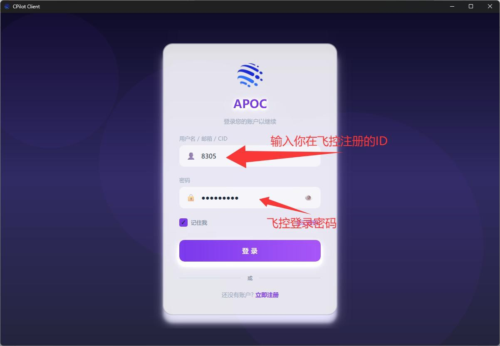
	如果未注册则可以[点击](https://pilot.apocfly.com/)，立即注册前往注册页面完成您的注册并填写好您的个人信息与账户。
3. 登陆后请打开设置,设置PTT（和管制联系按下你设置的键进行对话，松开停止对话），我们严厉禁止长时间按动此PTT按键以影响其他用户的正常对话，如出现违规操作，管制员与技术员将邀请您喝一杯温暖而又甜蜜的茶。
	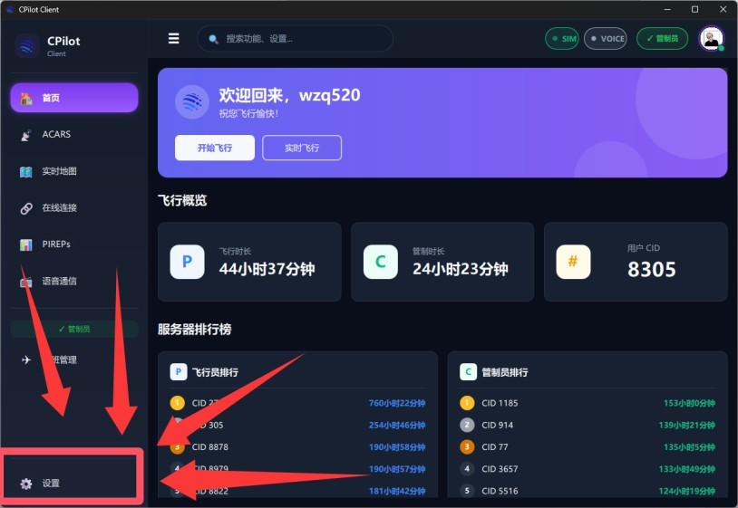
	在此处设置您的麦克风与扬声器，如果想测试麦克风的打开回环测试，测试扬声器的检查连接语音服务器时能不能听到 connect 的提示音，如果您可以听到声音并已经完成了设置，恭喜您向成功走了一大步！
	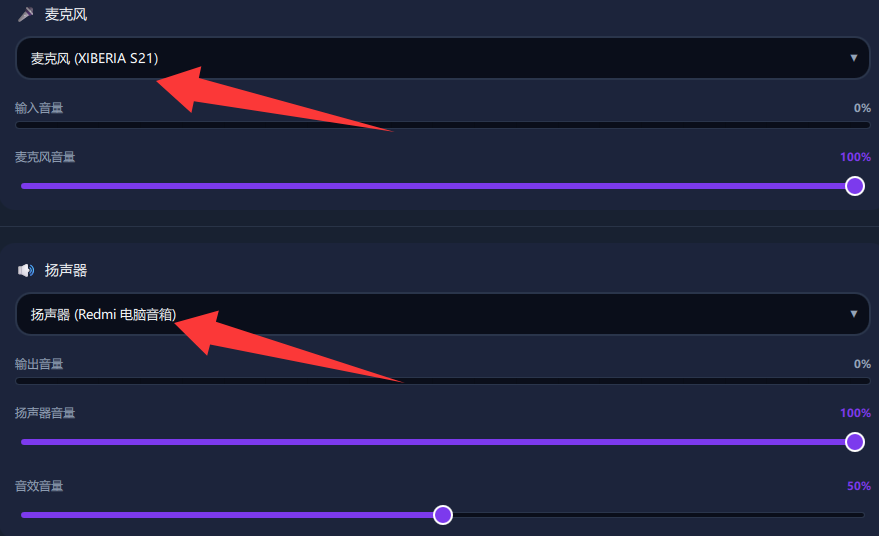
4. 接下来为了可以正确的检测您模拟器状态与插件运行服务，您需要正确的设置模拟器路径，微软飞行模拟2020/2024它通常在Microsoft Flight Simulator (2024)路径下，X-Plane 模拟器通常由Steam下载安装，它通常在steamapps路径下，当然如果您设置有效，他将显示有效的字样，相反您可能无法使用对应功能！
	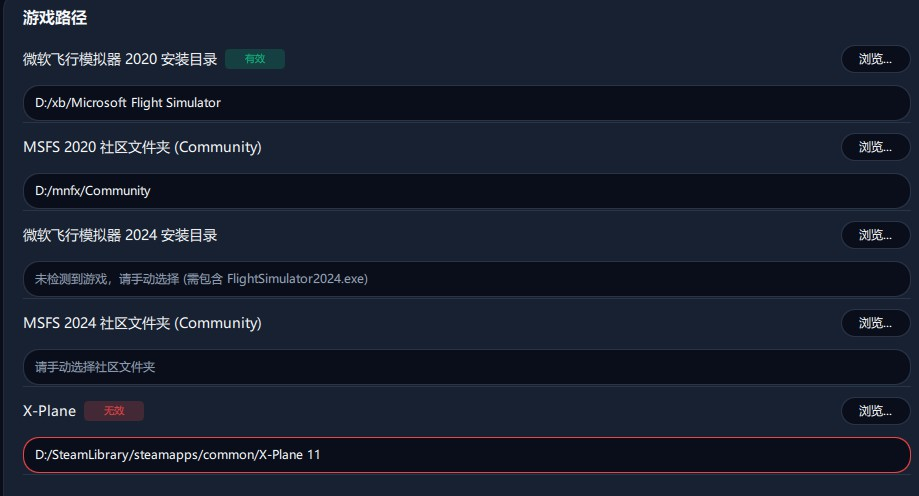
5. 完成以上所有操作后，便可以完成剩下的连接操作（打开游戏、连接服务器、完成语音连接） 
    您可以通过首页的开始飞行来打开游戏，并且来到ACARS页面连接模拟器并保证模拟器正常连接：
	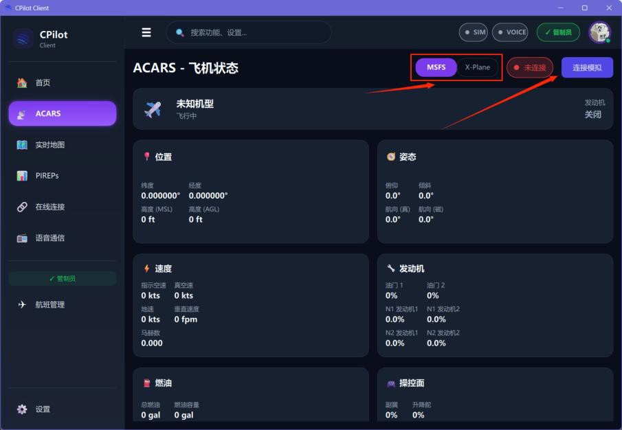
6. 正常连接模拟器后您可以在ACARS页面看到您飞机的实时状态数据，跳转到在线连接页面，输入您的呼号与密码完成连接（密码为您账户的唯一密码，呼号则不唯一）：
	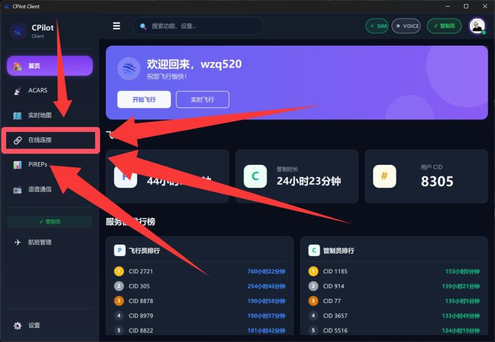
	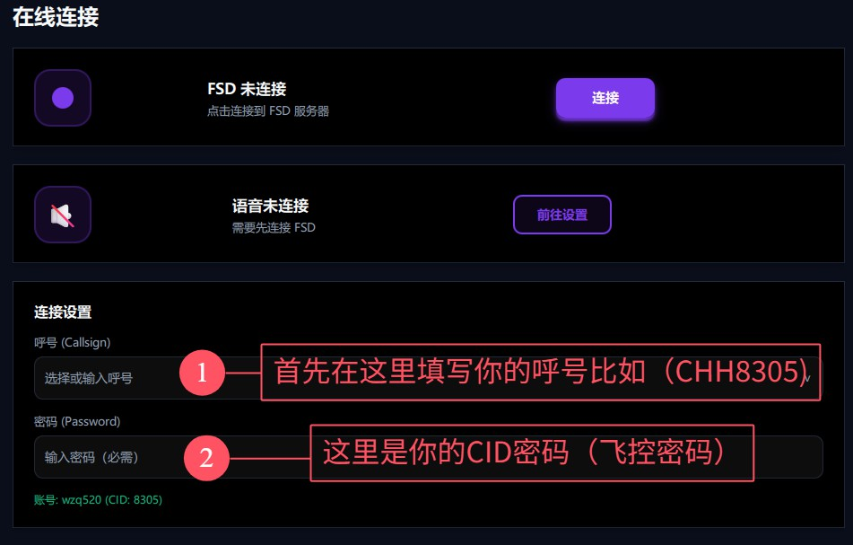
	完成填写后点击连接按钮进行连接
    如果需要提交飞行计划，您可以连接后在此页面提交飞行计划，也可以前往[官网飞行计划 - APOC](https://pilot.apocfly.com/flight-plans)来提交您的连接！
7. 如果您参加活动或接受管制服务，您需要前往语音通信页面（保证您已经完成了服务器连接），点击连接按钮完成链接
    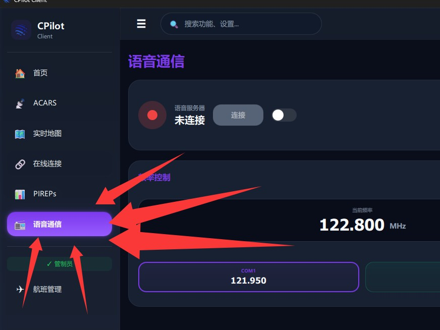
	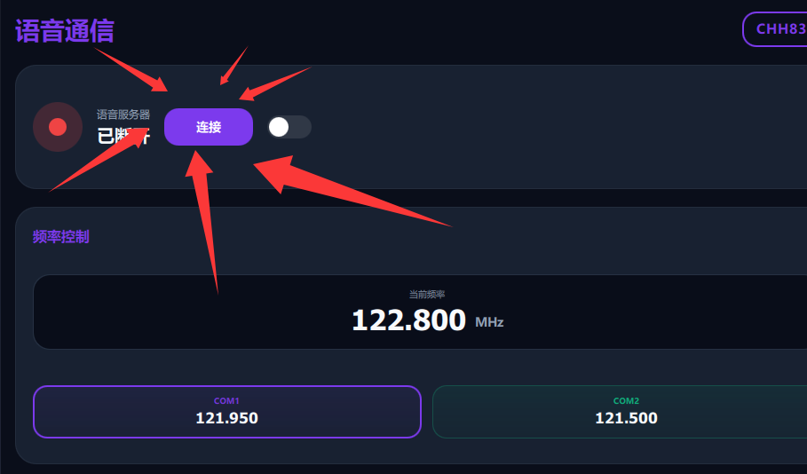
8. 如您需要更改频道，可以在飞机-无线电调频处调整您需要的频率
	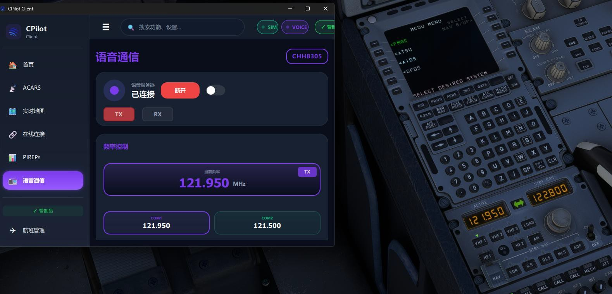
9. 如您想进行VACST虚拟航空公司的飞行，您则需要来到PIREPs页面并登录您的VACST账户完成飞行
	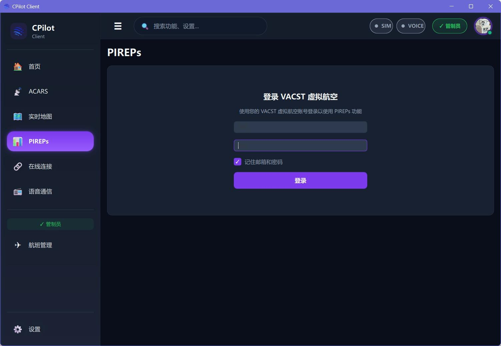
	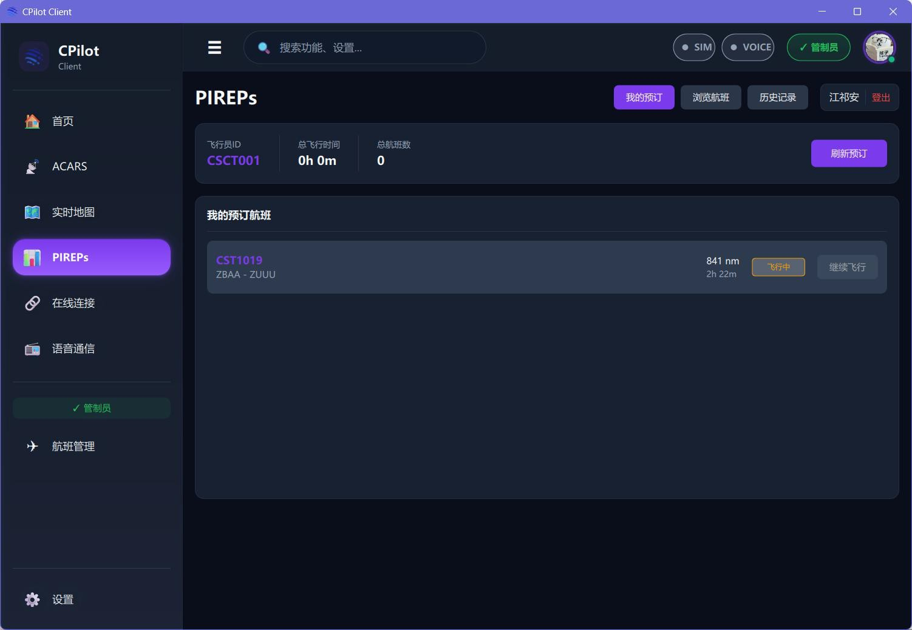

## 错误修复与反馈
Q：我看不到界面了，他貌似是透明或白色状态

A：需要前往设置-外观调整您的合适的主题，或您需要卸载客户端与缓存数据“C:\Users\用户名\AppData\Local\CPilot”

Q：我看不到其他飞机

A:您需要前往设置-游戏路径，正确设置您的游戏并打开映射插件、AI流量，如还是无法看到飞机您需要重装CPilot或映射插件

Q：我无法连接服务器，他似乎提示我JWT无效或过期

A: 您需要断开连接并重新连接服务器，如仍旧无效您需要重新打开软件并等待列表清理再进行连接

Q：我无法连接语音服务器，他似乎连上后自动断开

A: 您需要断开连接并重新连接服务器，如仍旧无效您需要重新打开软件并等待列表清理再进行连接

Q：我的账户被封禁了，点击登陆后无法登录

A: 您需要联系平台管理员8305、0926、1185、2352、0157任一即可

Q：我打开软件后提示 `[ERROR]` 错误，重装也无法修正此错误

A: 您需要联系平台技术员0157通过安装修复插件以完成修复，此过程只需要3-5分钟

## 相关链接

APOC平台官网 [https://www.apocfly.com](https://www.apocfly.com)
飞控：[https://pilot.apocfly.com](https://pilot.apocfly.com)
VACST虚拟航空公司：[https://va.cloudswoop.icu/airlines](https://va.cloudswoop.icu/airlines)
错误反馈：[工单反馈系统](https://work.cloudswoop.icu/)